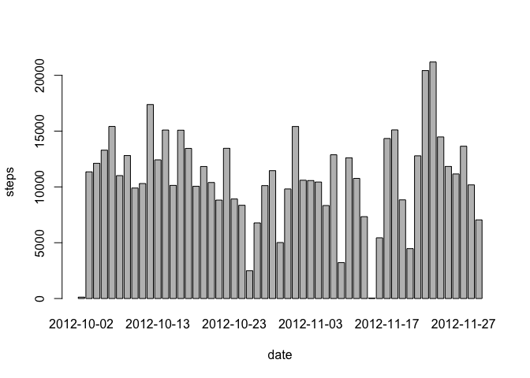

Loading and preprocessing the data
----------------------------------

    activity <- read.csv("activity.csv")
    head(activity)

    ##   steps       date interval
    ## 1    NA 2012-10-01        0
    ## 2    NA 2012-10-01        5
    ## 3    NA 2012-10-01       10
    ## 4    NA 2012-10-01       15
    ## 5    NA 2012-10-01       20
    ## 6    NA 2012-10-01       25

What is mean total number of steps taken per day?
-------------------------------------------------

<b>Step:</b> Make a histogram of the total number of steps taken each
day

    steps.date <- aggregate(steps ~ date, data = activity, FUN = sum)
    barplot(steps.date$steps, names.arg = steps.date$date, xlab = "date", ylab = "steps")

<b>Step:</b> Calculate and report the mean and median total number of
steps taken per day

    mean(steps.date$steps)

    ## [1] 10766.19

    median(steps.date$steps)

    ## [1] 10765

What is the average daily activity pattern?
-------------------------------------------

<b>Step:</b> Make a time series plot (i.e. type = "l") of the 5-minute
interval (x-axis) and the average number of steps taken, averaged across
all days (y-axis)

    steps.interval <- aggregate(steps ~ interval, data = activity, FUN = mean)
    plot(steps.interval, type = "l")

<b>Question:</b> Which 5-minute interval, on average across all the days
in the dataset,contains the maximum number of steps?

    steps.interval$interval[which.max(steps.interval$steps)]

    ## [1] 835

Imputing missing values
-----------------------

<b>Step:</b> Calculate and report the total number of missing values in
the dataset (i.e. the total number of rows with NAs)

    sum(is.na(activity))

    ## [1] 2304

<b>Step:</b> Devise a strategy for filling in all of the missing values
in the dataset.

<b>Strategy:</b> I will use the means for the 5-minute intervals to
replace the missing values.

<b>Step:</b> Create a new dataset that is equal to the original dataset
but with the missing data filled in.

    activity <- merge(activity, steps.interval, by = "interval", suffixes = c("", 
        ".y"))
    nas <- is.na(activity$steps)
    activity$steps[nas] <- activity$steps.y[nas]
    activity <- activity[, c(1:3)]

<b>Step:</b> Make a histogram of the total number of steps taken each
day and Calculate and report the mean and median total number of steps
taken per day.

    steps.date <- aggregate(steps ~ date, data = activity, FUN = sum)
    barplot(steps.date$steps, names.arg = steps.date$date, xlab = "date", ylab = "steps")

<b>Question:</b> Do these values differ from the estimates from the
first part of the assignment? What is the impact of imputing missing
data on the estimates of the total daily number of steps?

    mean(steps.date$steps)

    ## [1] 10766.19

    median(steps.date$steps)

    ## [1] 10766.19

The impact of the missing data looks low. It <i>might be</i> beccause of
the method we used to impute the missing values.

Are there differences in activity patterns between weekdays and weekends?
-------------------------------------------------------------------------

<b>Step:</b> Create a new factor variable in the dataset with two levels
??? ???weekday??? and ???weekend??? indicating whether a given date is a
weekday or weekend day.

    daytype <- function(date) {
        if (weekdays(as.Date(date)) %in% c("Saturday", "Sunday")) {
            "weekend"
        } else {
            "weekday"
        }
    }
    activity$daytype <- as.factor(sapply(activity$date, daytype))

<b>Step:</b> Make a panel plot containing a time series plot (i.e. type
= "l") of the 5-minute interval (x-axis) and the average number of steps
taken, averaged across all weekday days or weekend days (y-axis)

    par(mfrow = c(2, 1))
    for (type in c("weekend", "weekday")) {
        steps.type <- aggregate(steps ~ interval, data = activity, subset = activity$daytype == 
            type, FUN = mean)
        plot(steps.type, type = "l", main = type)
    }

